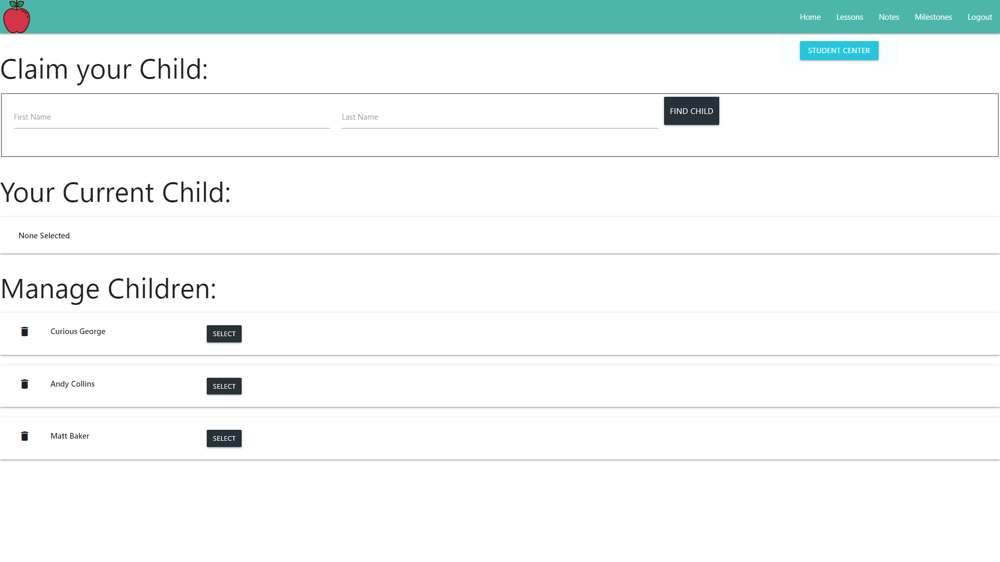

# Welcome to Reach2Teach! 
Have you ever found yourself in the position of teaching a toddler and wished you had a tool to lesson plan and scrapbook all at once? Would you like a way to keep your students, their lessons, and their milestones in one place so that they are quickly accessible?  Do you even want a way to reach out to parents and show them their child's progress? If you answered yes, look no futher than Reach2Teach.

## Why was Reach2Teach created?
As a software developer, I spend a large amount of time trying to solve problems, so when my little sister wanted to start teaching my nephew, I wanted to give her the perfect tool to achieve that, while making her planning and growth tracking as easy as possible. 

## What is Reach2Teach?
Reach2Teach is a single page, React application that was designed to save early childhood teachers time by giving them a means to manage their students, make and record lesson plans on the fly, write private or public notes, and track milestones achieved by the child, all easily accessible in one central place. With Reach2Teach, teachers have the ability to do all of these things with full CRUD functionality. This app also gives parents the ability to find their child in the database and track their growth, while recieving updates fromt he teacher, in a more read-only view of the site.

## Want to use Reach2Teach? Follow the instructions bellow to run the application.

1. Clone down this repository by clicking the "Clone or Download" button above, copying the SSH key, and running the following command in your terminal `git clone SSH KEY GOES HERE`.
1. `cd` into the root directory of the app.
1. Run `npm install` and wait for all dependencies to be installed.
1. Run `npm start` to verify that installation was successful and start the application.
1. `cd` into the /api directory, and create a db.json file. 
1. In the api folder, run `json-server -p 5002 -w db.json`.
1. Go to http://localhost:3000/ to view the app. 

## What can you do with Reach2Teach?
1. After completing the setup above, in the browser, navigate to http://localhost:3000.
2. If you are a returning user, login to Reach2Teach with your account information.
3. Never signed up for Reach2Teach before? No problem! Click the register link and complete your registration.

4. Once you have logged into the app, you will be taken to your personal home page. Click on the flashing student center button to get started planning. Here you can create or select a student to work with. To edit or delete a student, hover over the student card and click the appropriate icon. Please note that current student will also keep track of the current student selected. 

5. After selecting a student let's go to the lessons page. From here you can create new lessons or manage existing ones. Clicking manage on a lesson card will pull up more details about that lesson and will open up options to edit or delete the lesson as well.

6. If you choose the "Notes" option from the navigation bar, you will be taken to a page where you can create new notes, or edit and delete existing notes. If you choose to create a new note, you are also given the choice to make the note public or private, a decision that determines whether or not the parent of the child can see said note.

7. Last but certainly not least in our teacher user view, is the Milestones view.  In this section you can manage and track the child's growth through the creation of milestones. Upon clicking Manage Milestones, you will be able to create new milestones, and edit/delete existing milestones.  These milestones can then be checked off from the main milestones view, timestamping them with the current date to always be remembered and seen by both the teacher and the parent user.  This checklist also orders by completed/checked milestones first, no matter the order they are created.

8. The parent user view is more limited but still meets its purpose.  To protect the child's data, for basic security, the parent must know the name of their own child to access their progress. Upon claiming the child, they can then select the child and view public notes that the teacher has left for them, or they can see their child's datestamped milestones to watch their growth in real time.

## Reach2Teach Tech Stack

&nbsp&nbsp&nbsp&nbsp&nbsp&nbsp&nbsp&nbsp&nbsp&nbsp&nbsp&nbsp&nbsp&nbsp&nbsp&nbsp&nbsp&nbsp&nbsp&nbsp&nbsp&nbsp&nbsp&nbsp&nbsp&nbsp&nbsp&nbsp&nbsp&nbsp&nbsp&nbsp&nbsp&nbsp&nbsp&nbsp&nbsp&nbsp&nbsp&nbsp&nbsp&nbsp&nbsp&nbsp&nbsp&nbsp&nbsp&nbsp&nbsp&nbsp&nbsp&nbsp&nbsp&nbsp&nbsp&nbsp&nbsp&nbsp&nbsp&nbsp&nbsp&nbsp&nbsp&nbsp

&nbsp&nbsp&nbsp&nbsp&nbsp&nbsp&nbsp&nbsp&nbsp&nbsp&nbsp&nbsp&nbsp&nbsp&nbsp&nbsp&nbsp&nbsp&nbsp&nbsp&nbsp&nbsp&nbsp&nbsp&nbsp&nbsp&nbsp&nbsp&nbsp&nbsp&nbsp&nbsp

